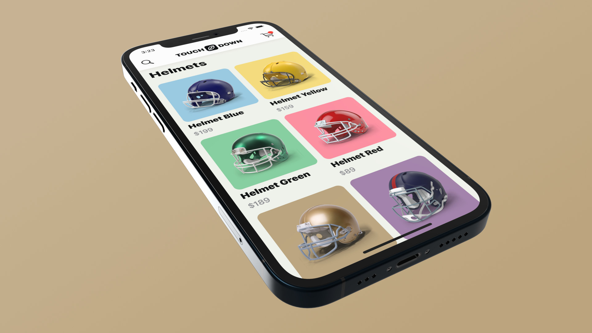

# SwiftUI 2 - TOUCHDOWN
 

  
  

    Let’s develop together a modern E-commerce mobile application with the SwiftUI framework. This time we are going to create a more realistic iOS 14 app prototype and covering some important programming concepts as well.
  

## Topics are covered:

- [x] How to prototype an e-commerce mobile application
- [x] How the @Environment property wrapper works
- [x] How to use the Observable Object property wrapper
- [x] How to share the data model across the whole application with ease
- [x] How to store all constants in a separate Swift file
- [x] How to create a custom shape with Shape Path
- [x] How to use the horizontal grid layout in SwiftUI
- [x] How to develop a custom navigation bar
- [x] How to proportionally resize the size of an item in the Page Tab view
- [x] How to optimize the app for different screen sizes

## Demo

  
  

    App icon
  

  
  

    Touchdown app
  

  
  

    Products grid layout
  

  
  

    Product detail view
  

  
  

    Dynamic colors
  

  
  

    Screen sizes from mini to max pro
  

## Meta

Tin Tran – [@realtrantrungtin](https://www.linkedin.com/in/realtrantrungtin) – realtrantrungtin@gmail.com
